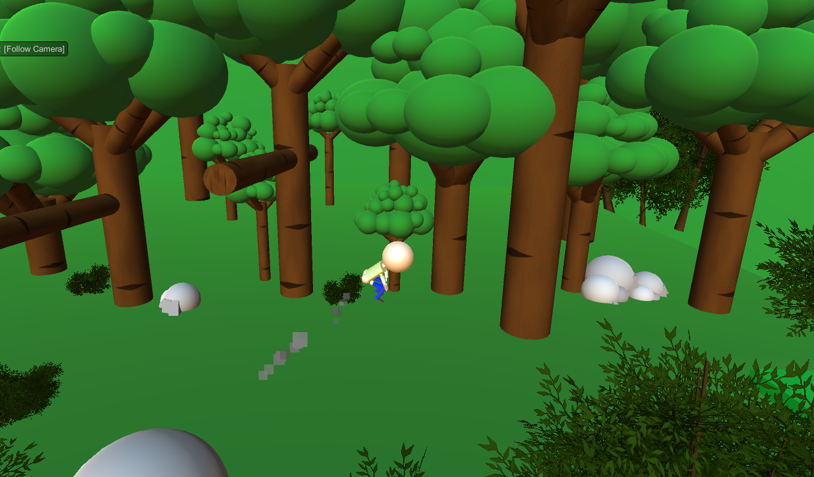

# Farty McFart

### Practice project for Unity and C#

This is an ongoing project I come back every now and then to add more difficult and complex levels to. The (silly, rudimentary) physics are there, I just moved on to other projects to keep learning new stuff.

## Check the game out <a href="https://i.simmer.io/@ianisout/farty-mcfart"> HERE! </a> 💨

<strong>IMPORTANT NOTE:</strong> the game is running laggy on Chrome due to the browser's WebGL support. If the game is not running smoothly on your browser, please try a different one (Edge, Firefox, Opera, etc)